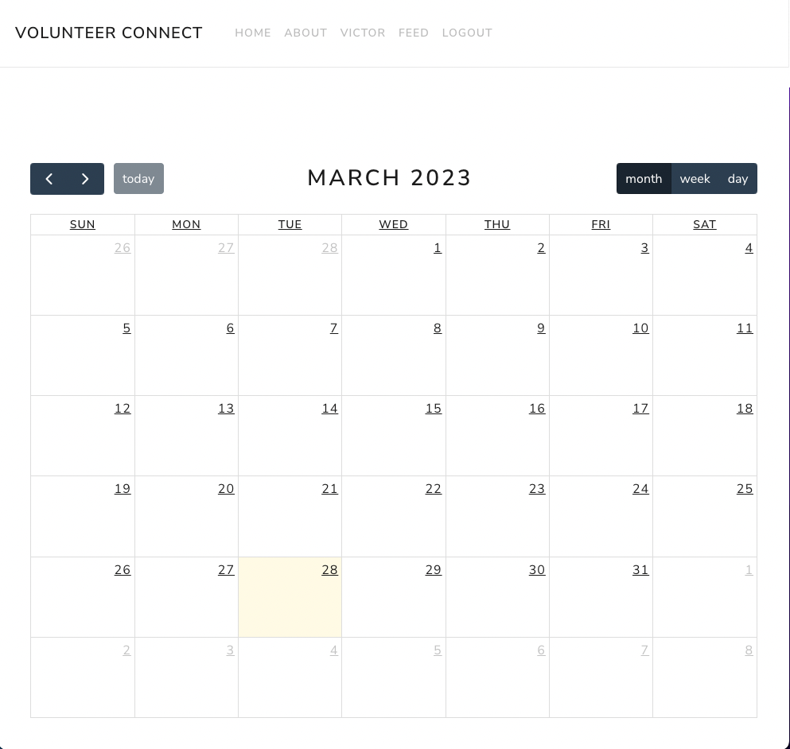
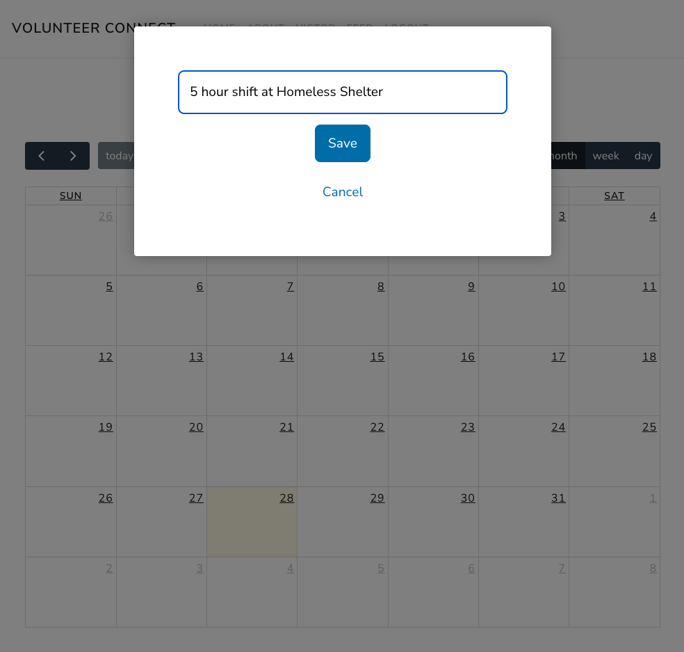
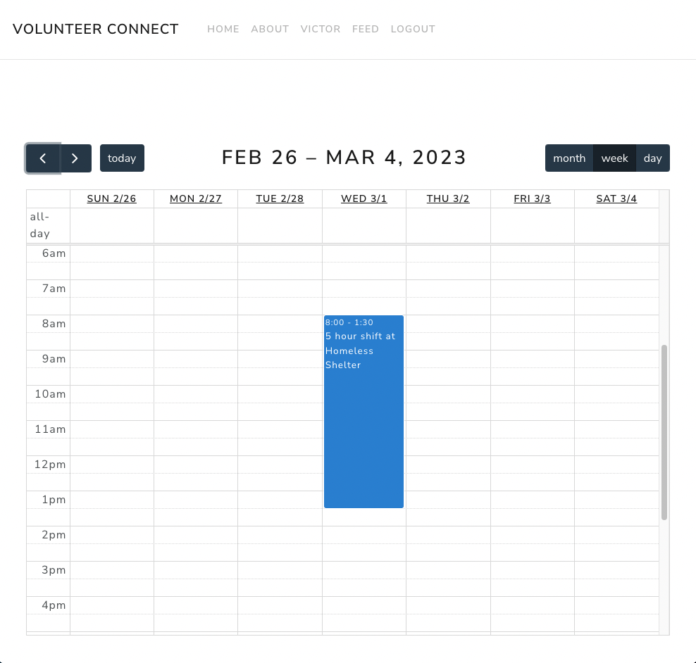
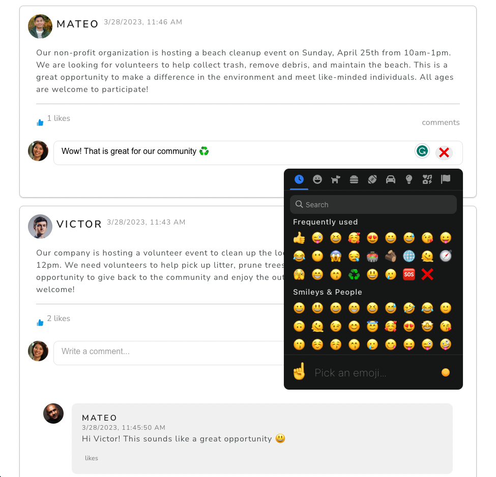
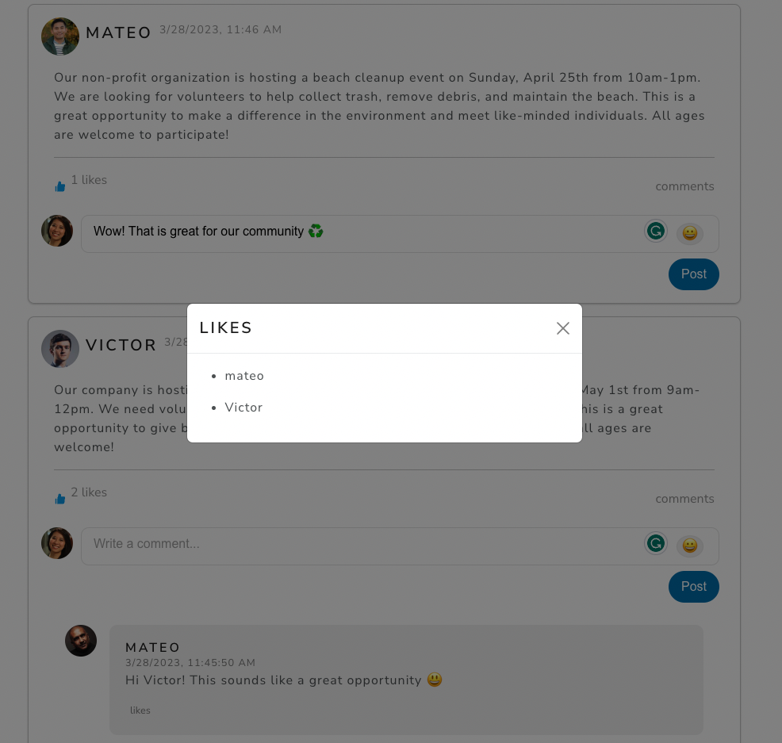

# Volunteer Connect

## Description

This web application is designed for companies and users to find volunteer opportunities through posts and comments. If a user is interested in one of the opportunities then they can go to the home page and select the day they would like to volunteer.

## Screenshots

## Technology Stack

The application is built using the following technologies:

## MClient-side

- React
- Redux for state management
- Fullcalendar for the calendar and selecting days
- Normalized state to implement optimistic updates for users, posts, comments and likes
- Formik and Yup for creating the sign-up form
- Axios to fetch data from the database
- Bootstrap for styling
- Emoji-mart for emojis

## Server-side

- Node.js with Express for the server
- MongoDB using Mongoose for data storage
- Bcrypt for password hashing
- JSON Web Tokens for authentication
- Dotenv for environment variables
- CORS for cross-origin resource sharing
- Nodemon for development

## Usage

Once the application is running, users can sign up and log in to browse volunteer opportunities posted by companies. Users can leave comments and react to posts with emojis. If a user is interested in volunteering, they can go to the home page and select the day they would like to volunteer.

## Contributing

Contributions to this project are welcome. If you have any ideas or suggestions, please create an issue or a pull request.

## License

This project is licensed under the MIT license. See LICENSE for more information.
